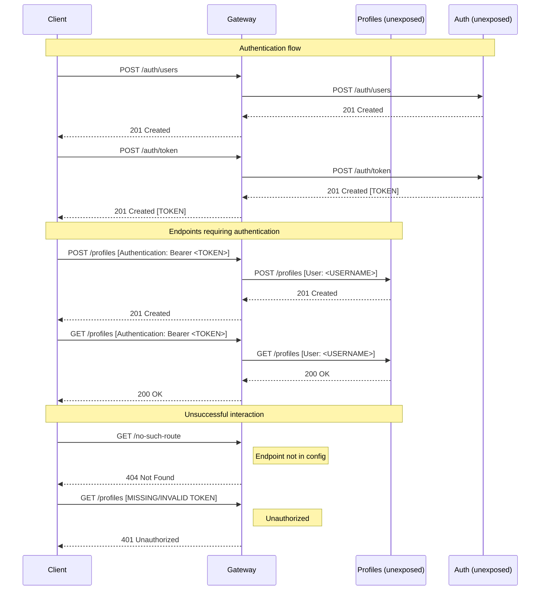

# JSON API Gateway

 - [x] Provides a single entry point for dockerized JSON APIs
 - [x] Utilizes both AIOHTTP Server and Client functionalities
 - [x] Incoming requests are matched against a config file and discarded in case of no match
 - [x] Both Server and Client operate async, allowing best performance
 - [x] Supports JWT authentication (appends "user" header to service requests)
 - [ ] TODO: Create GET /stats endpoint

## Usage

1. Run `docker compose up` for local development
2. In the AUTH container, run `alembic upgrade heads` and `alembic revision --autogenerate` to apply necessary migrations
3. Send some requests to available endpoints

## Available Endpoints

- POST create a user http://auth:8000/auth/users (PUBLIC)
- POST create an access token http://auth:8000/auth/token (PUBLIC)
- GET existing profiles http://localhost:8000/profiles (JWT REQUIRED)
- POST create a profile http://localhost:8000/profiles (JWT REQUIRED)
- GET profile by ID http://localhost:8000/profiles/{profile_id} (JWT REQUIRED)
- PATCH profile by ID http://localhost:8000/profiles/{profile_id} (JWT REQUIRED)
- DELETE profile by ID http://localhost:8000/profiles/{profile_id} (JWT REQUIRED)

## Authentication
1. Use POST /auth/users to create a user
2. Send your credentials over to POST /auth/token in order to generate a JWT
3. Include `Authorization: Bearer {your_token}` in your request headers

## Sequence Diagram

