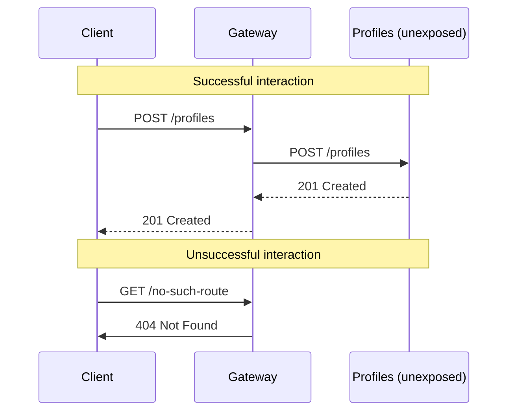

# JSON API Gateway

 - [x] Utilizes both AIOHTTP Server and Client functionalities
 - [x] Provides a single entry point for dockerized JSON APIs
 - [x] Incoming requests are matched against a config file and discarded in case of no match
 - [x] Both Server and Client operate async, allowing best performance
 - [ ] TODO: Add JWT authentication
 - [ ] TODO: Create GET /stats endpoint

## Usage

1. Run `docker compose up` for local development
2. Send some requests to available endpoints

## Available Endpoints

- GET existing profiles http://localhost:8000/profiles
- POST create a profile http://localhost:8000/profiles
- GET profile by ID http://localhost:8000/profiles/{profile_id}
- PATCH profile by ID http://localhost:8000/profiles/{profile_id}
- DELETE profile by ID http://localhost:8000/profiles/{profile_id}

## Sequence Diagram

